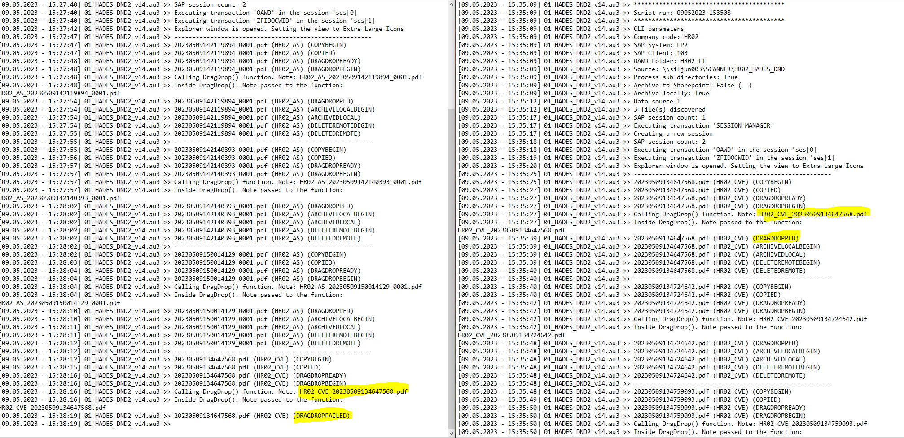

# HADES Drag and Drop

## Uploads files to SAP via OAWD transaction

HADES.au3 -s|--system -c|--client -src|--source -cc|--companycode -oawd [-nosub|--nosubdir] [-as|--archivesharepoint] [-nal|--noarchlocal]  
```
-s | --system <- Mandatory parameter  
-c | --client <- Mandatory parameter  
-src | --source <- Mandatory parameter  
-cc | --companycode <- Mandatory parameter  
-oawd <- Mandatory parameter  
-nosub | --nosubdir <- Optional parameter  
-as | --archivesharepoint <- Optional parameter  
-nal | --noarchlocal <- Optional parameter  
```  
  
  
### Example Call #1  
-s fq2  -c 105  -oawd "SI01 FI Scan"  -src C:\!AUTO\SI01_HADES_DND_NET  -cc si01  -nal	-nosub	-as  https://TENANT.sharepoint.com/sites/unit-hades/SI01_HADES_ARCHIVE  
```
-s SAP System nane
-c SAP Client name
-oawd OAWD folder name
-src Source folder where to look for files to be uploaded
-cc Company code
-nal Do not archive uploaded files locally
-nosub Do not process subdirectories in the source directory. Only process source dir 
-as Archive uploaded file to the sharepoint library
```

### Example Call #2
-s fq2 -c 105 -src https://TENANT.sharepoint.com/sites/unit-hades/SI01_HADES_SOURCE -cc si01 -nal -nosub -as https://TENANT.sharepoint.com/sites/unit-hades/SI01_HADES_ARCHIVE -oawd "SI01 FI Scan"
### Example Call #3
-s fq2 -c 105 -oawd "SI01 FI Scan" -src \\\Czpragn006\hades_qa -cc si01 -as https://TENANT.sharepoint.com/sites/unit-hades/SI01_HADES_ARCHIVE -oawd "SI01 FI Scan"  
### Example Call #4
-s fq2 -c 105 -oawd "SI01 FI Scan" -src \\\10.229.128.6\mk01_hades_dnd -cc si01 -as https://TENANT.sharepoint.com/sites/unit-hades/SI01_HADES_ARCHIVE

### Exit codes
```
1-99 - Something other than errors e.g no parameters passed
100 - General script errors
200 - SAP related errors
300 - Sharepoint related errors
```  

## How it works  

Script processes in one-at-a-time fashion. Each file goes through multiple states and is considered processed only when it reaches the final state.

Each file in the source location has its initial state STATE_INITIAL   

We then check whether the file does not exceed the size limit and is of a accepted file type, .pdf in this case   
If the file satisfies these two conditions it's moved to the STATE_OK state, otherwise it's stated is STATE_INVALID  

```autoit
If $File[$FILE_SIZE] >= $MAX_SIZEINBYTES Then
	  If $MAX_SIZEINBYTES <> -1 Then
		 $InvalidFiles = $InvalidFiles + 1
		 LogEvent($LogFile, $File[$FILE_NAME] & " (" & $File[$FILE_PARENTFOLDER] & ") (" & $FileState[$File[$FILE_STATUS]] & ")", False)
		 LogEvent($LogFile, $File[$FILE_NAME] & " (" & $File[$FILE_PARENTFOLDER] & ") exceeding the $MAX_SIZEINBYTES (" & $MAX_SIZEINBYTES & ") File size -> " & $File[$FILE_SIZE], False)
		 $File[$FILE_STATUS] = $STATE_INVALID ; Set state STATE_INVALID (file size)
		 LogEvent($LogFile, $File[$FILE_NAME] & " (" & $File[$FILE_PARENTFOLDER] & ") (" & $FileState[$File[$FILE_STATUS]] & ")", False)
	  EndIf
   ElseIf Not StringRegExp($File[$FILE_NAME],"pdf$") Then
	  $InvalidFiles = $InvalidFiles + 1
	  LogEvent($LogFile, $File[$FILE_NAME] & " (" & $File[$FILE_PARENTFOLDER] & ") (" & $FileState[$File[$FILE_STATUS]] & ")", False)
	  LogEvent($LogFile, $File[$FILE_NAME] & " is not a valid .pdf file", False)
	  $File[$FILE_STATUS] = $STATE_INVALID ; Set state STATE_INVALID (file type)
	  LogEvent($LogFile, $File[$FILE_NAME] & " (" & $File[$FILE_PARENTFOLDER] & ") (" & $FileState[$File[$FILE_STATUS]] & ")", False)
   Else
	  $ValidFiles = $ValidFiles + 1
	  $File[$FILE_STATUS] = $STATE_OK ; Set state STATE_OK
   EndIf
```
From STATE_OK file moves to STATE_COPYBEGIN and we try to copy the file to the local cache    
Only if copying is successfull the file is allowed to move to STATE_COPIED 
```autoit
   If $File[$FILE_STATUS] = $STATE_OK Then
	  $File[$FILE_STATUS] = $STATE_COPYBEGIN
	  LogEvent($LogFile, $File[$FILE_NAME] & " (" & $File[$FILE_PARENTFOLDER] & ") (" & $FileState[$File[$FILE_STATUS]] & ")", False)

	  Switch $DataSource

		 Case $SOURCE_NETDRIVE
			If $CliParams[$CLI_SUBDIRS] Then
			   If FileCopy($File[$FILE_PATH], $PathSrc & "\" & $File[$FILE_PARENTFOLDER] & "_" & $File[$FILE_NAME]) Then
				  $File[$FILE_STATUS] = $STATE_COPIED
				  LogEvent($LogFile, $File[$FILE_NAME] & " (" & $File[$FILE_PARENTFOLDER] & ") (" & $FileState[$File[$FILE_STATUS]] & ")", False)
			   EndIf
			Else
			   If FileCopy($File[$FILE_PATH], $PathSrc & "\" & $File[$FILE_NAME]) Then
				  $File[$FILE_STATUS] = $STATE_COPIED
				  LogEvent($LogFile, $File[$FILE_NAME] & " (" & $File[$FILE_PARENTFOLDER] & ") (" & $FileState[$File[$FILE_STATUS]] & ")", False)
			   EndIf
			EndIf

		 Case $SOURCE_SHAREPOINT
			If $CliParams[$CLI_SUBDIRS] Then
			   If SPDownloadFile($Http, $File[$FILE_PATH], $PathSrc & "\" & $File[$FILE_PARENTFOLDER] & "_" & $File[$FILE_NAME], $SpAccessToken) Then
				  $File[$FILE_STATUS] = $STATE_COPIED
				  LogEvent($LogFile, $File[$FILE_NAME] & " (" & $File[$FILE_PARENTFOLDER] & ") (" & $FileState[$File[$FILE_STATUS]] & ")", False)
			   EndIf
			Else
			   If SPDownloadFile($Http, $File[$FILE_PATH], $PathSrc & "\" & $File[$FILE_NAME], $SpAccessToken) Then
				  $File[$FILE_STATUS] = $STATE_COPIED
				  LogEvent($LogFile, $File[$FILE_NAME] & " (" & $File[$FILE_PARENTFOLDER] & ") (" & $FileState[$File[$FILE_STATUS]] & ")", False)
			   EndIf
			EndIf
	  EndSwitch
   EndIf
```


Here the file didn't reach the state STATE_DRAGDROPPED.  
There could've been many reasons and therefore execution stops and the file is deleted from the local cache.  
Email message containing log file is sent  


Usually we're able to recover and process the file that failed during the next script run  



